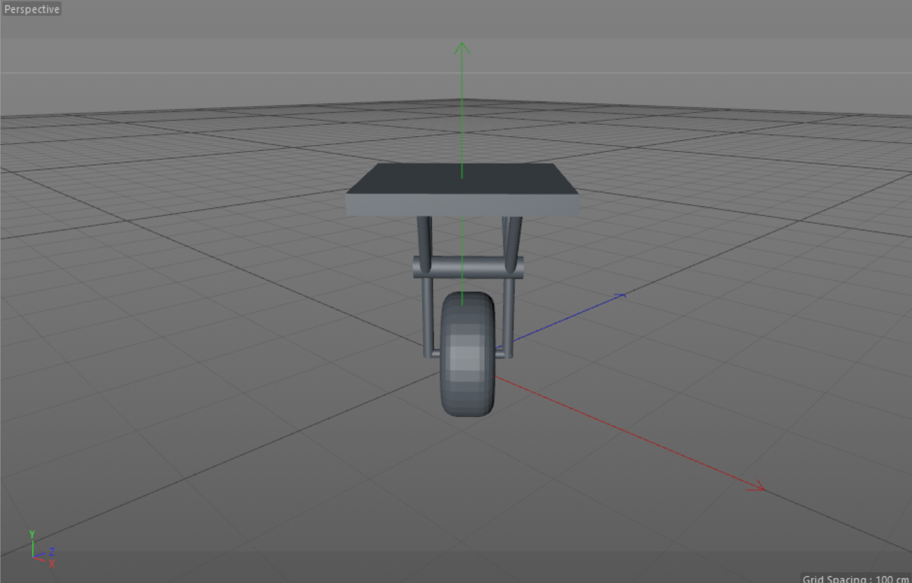
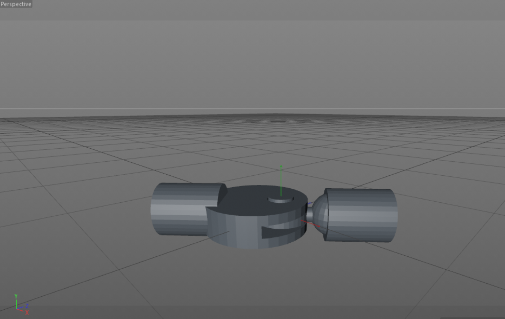

# Suspension-Design

## Basics💡  
### Suspension is to maximize the friction between the tires and the road surface,toprovide steering stability with good handling and to ensure the comfort of thepassengers

## How does the suspension system work ⚒❓ 
### The suspension control arms or links allow wheel movement independent of the body. This provides a mechanism to isolate body from the road bumps. The springs manipulate the frequency of road disturbances and try to bring them into a more manageable band. They also provide damping through friction (spring ends and the seat) and own hysteresis. The damper dissipates the energy of the dynamic load coming through the road bumps. Together,they try to eliminate the effects of road undulations on the ride as well as stability of the vehicle

## Requirement of a Suspension system ⚙️ 
### Deflection should be kept to a bare minimum. 
### It should be as light as possible. 
### It should be low-maintenance and low-cost to operate. 
### It should have the least amount of tire wear possible. 
### It should have a low start-up cost. 

## Diagram of suspension system🔩  
  

## Diagram of Knee Joint🦿 
 

